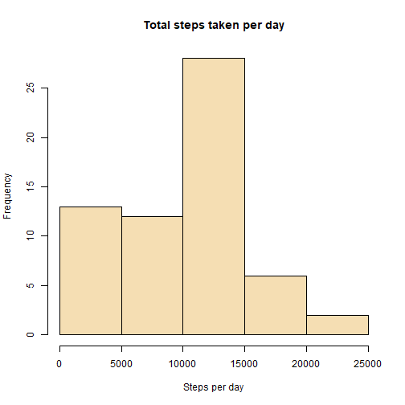
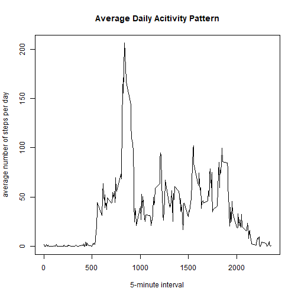
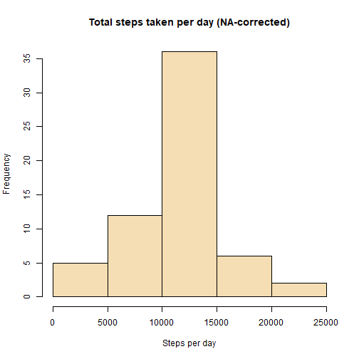
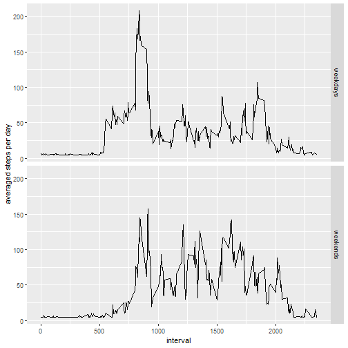

## Reproducible Research Course Project 1 - Activity monitoring data  
####################################################################


Loading libraries

```r
library(readr)
library(data.table)
library(dplyr)
library(ggplot2)
library(lubridate)
```

### Step 1: Loading data and convert date-string into date-class using lubridate package

```r
activity <- read.csv("./activity.csv", na.strings = "NA", sep = ",", header=TRUE)
activity$date <- ymd(activity$date)
```

### Step 2: What is mean total number of steps taken per day?


```r
total_steps_per_day <- tapply(activity$steps, activity$date, sum, na.rm = TRUE)
hist(total_steps_per_day, xlab = "Steps per day", main = "Total steps taken per day", col="wheat")
```



Give out mean and median using summary statistics: 

```r
summary(total_steps_per_day)
```

```
##    Min. 1st Qu.  Median    Mean 3rd Qu.    Max. 
##       0    6778   10395    9354   12811   21194
```

### Step 3: What is the average daily activity pattern?

```r
mean_steps_per_day <- setnames(aggregate(activity$steps, 
                      by=list(activity$interval), na.rm = TRUE, FUN = mean), c("interval","steps"))
```

```r
plot(mean_steps_per_day$steps ~ mean_steps_per_day$interval, type="l", 
      main = "Average Daily Acitivity Pattern", xlab="5-minute interval", 
      ylab="average number of steps per day")
```



Which 5-minute interval, on average across all the days in the dataset, contains the maximum number of steps?


```r
index <- which.max(mean_steps_per_day$steps)
max_interval <- mean_steps_per_day[index,1]
print(paste("5-Min interval containing maximum number of steps on average:", max_interval))
```

```
## [1] "5-Min interval containing maximum number of steps on average: 835"
```

### Step 4: Imputing missing values
Calculate and report the total number of missing values in the dataset

```r
NAs <- sum(is.na(activity$steps))
print(paste("Total number of NAs:", NAs))
```

```
## [1] "Total number of NAs: 2304"
```

Create new dataset with missing data filled in, replacing NA with global average interval activity:

```r
activity_complete_impute <- activity
    NA_index <- which(is.na(activity$steps))
    for (i in NA_index){
        activity_complete_impute$steps[i] <- mean(activity$steps, na.rm = TRUE)
    }
```
Make histogram of total number of steps taken each day:

```r
total_steps_complete <- tapply(activity_complete_impute$steps, activity_complete_impute$date, 
                               sum, na.rm = TRUE) 
hist(total_steps_complete, xlab = "Steps per day", main = "Total steps taken per day (NA-corrected)", col="wheat")
```



Calculate and report the mean and median total:

```r
summary(total_steps_complete)
```

```
##    Min. 1st Qu.  Median    Mean 3rd Qu.    Max. 
##      41    9819   10766   10766   12811   21194
```
What is the impact of imputing missing data on the estimates of the total daily number of steps?
Mean and median are equal.

### Step 5: Are there differences in activity patterns between weekdays and weekends?
Create a new factor variable in the dataset with two levels – “weekday” and “weekend and make a panel plot:

```r
Sys.setlocale("LC_TIME", "US")
```

```
## [1] "English_United States.1252"
```

```r
weekdays <- c('Monday', 'Tuesday', 'Wednesday', 'Thursday', 'Friday')
activity_complete_impute$wday <- factor((weekdays(activity_complete_impute$date) %in% weekdays), 
                                levels=c(TRUE, FALSE), labels=c('weekdays', 'weekends') )
```

```r
mean_steps_day_impute <- setnames(aggregate(activity_complete_impute$steps,
                            by=list(activity_complete_impute$interval, activity_complete_impute$wday),                             na.rm = TRUE, FUN = mean), c("interval", "wday", "steps"))
```

```r
qplot(interval, steps, data = mean_steps_day_impute, geom="line", 
      ylab = "averaged steps per day", facets=wday~.)
```


